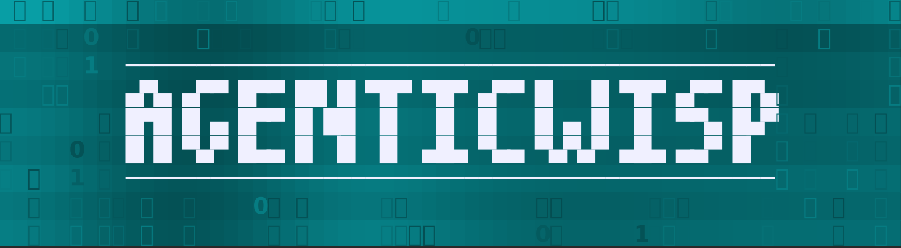
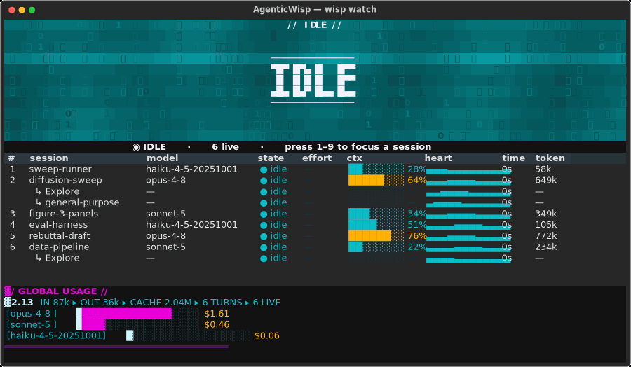
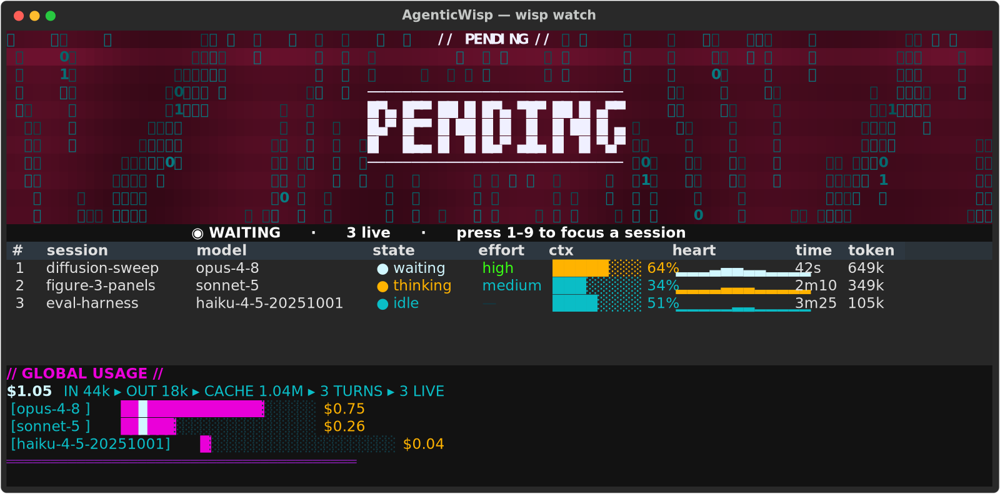

<p align="center">
  
</p>

<p align="center">
  <b>A status light and a status line for Claude Code — wrapped in a cyberpunk terminal panel.</b>
</p>

<p align="center">
  <a href="https://pypi.org/project/agenticwisp/"></a>
  
  
  
  
</p>

<p align="center"><b>English</b> · <a href="README.zh-CN.md">简体中文</a> · <a href="README.zh-TW.md">繁體中文</a></p>

<p align="center">
  
</p>

Claude Code already tells you what it's doing — but not at a glance, and not across several sessions at once. AgenticWisp reads its live state from hooks and turns it into a **light**: the color is the state (thinking · running a tool · waiting on you · done · error), and under it runs a **status line's** worth of detail — model, context window, tokens, running cost — one row per session.

And it's a *nice* light. The panel is a neon TUI — a plasma "reactor" that spells out the current state in big letters, a katakana data-rain, a heartbeat that pulses per session — because something you leave open all day might as well look like it's from a better future.

It's small — a standard-library core plus one tiny hub — and it starts with one command.

## When it's your turn, you'll know

The one state that actually needs *you* — a question, a permission prompt, a plan to approve — turns the whole panel red and spells out **PENDING**. Hard to miss, on purpose.

<p align="center">
  
</p>

## What you get

- **A status light** — one color per state, so a glance across every session tells you what, if anything, needs you.
- **A status line** — model, reasoning effort, a context-window gauge, tokens, and a live cost estimate, per session (and per subagent).
- **A cyberpunk TUI** — the Reactor Core, plasma, data-rain, per-session heartbeats, the red PENDING alarm. Tuned to stay smooth even over a laggy connection.
- **Three ways to look** — the full `textual` panel, a self-contained browser page, and a zero-dependency fallback lamp.
- **Barely there** — the hub, hooks, and browser lamp are pure Python standard library; only the fancy panel needs `textual`. Nothing phones home; the hub binds `127.0.0.1` only.
- **Never in the way** — the hook client has a 0.3 s timeout, swallows every error, and always exits 0. The light can fail; your Claude session never will.

## Who it's for

Anyone who runs Claude Code and wants to know what it's up to without babysitting it — whether that's one session or ten. Especially if you'd like your terminal to look the part.

## Quick start

> **Platform:** Linux, macOS, or Windows through **WSL**. The launcher is a bash script and assumes a Unix shell, so **native Windows (cmd / PowerShell) isn't supported** — run it inside WSL.

```bash
pipx install "agenticwisp[tui]"          # from PyPI (the fancy panel needs the [tui] extra)
# or, from source, no PyPI account needed:
#   pipx install "git+https://github.com/martinghl/AgenticWisp.git"

wisp demo            # see it now — a self-contained animated tour, no Claude needed
```

Then wire it to Claude Code:

```bash
wisp up              # start the hub (backgrounds itself; binds 127.0.0.1 only)
wisp install-hooks   # merge hooks into ~/.claude/settings.json (backup kept), then restart Claude Code
wisp watch           # open the panel   (add --simple for a stdlib-only fallback)
```

Prefer a checkout? `git clone https://github.com/martinghl/AgenticWisp.git && cd AgenticWisp && bin/wisp demo` works too.

## Connect it to Claude Code

```bash
bin/wisp install-hooks    # fills in its own path, merges into ~/.claude/settings.json (backup kept)
# then restart your Claude Code session
```

Prefer to wire it by hand? Copy the `hooks` block from [`hooks/settings-snippet.json`](hooks/settings-snippet.json) into `~/.claude/settings.json` and swap in your clone's path. Either way: you type → 🟡, it runs a tool → 🟣, it needs you → 🔴 **PENDING**, it finishes → 🟢.

## How it works

```
  Claude Code hooks
    └─ wisp signal <event> ─▶  wispd (the hub) ─┐
       reads session/tool       127.0.0.1:9099   │  displays subscribe:
       from the hook's stdin     + Claude's       ├─ terminal panel   (bin/wisp watch)
                                 session roster    └─ browser page     (GET / over the hub)
```

- **`wisp signal`** — the hook client. Posts the event to the hub and exits. 0.3 s timeout, swallows errors, always exits 0.
- **`wispd`** — the hub. Tracks per-session (and per-subagent) state, joins it with Claude's own session registry for names and working directories, and reads each transcript for model, context, tokens, and cost. Binds `127.0.0.1` only.
- **the displays** poll the hub. The panel paints whatever terminal you run it in; the browser page is served by the hub at `GET /`.

## The panel

| key | action |
|-----|--------|
| `1`–`9` | focus that session (the reactor tracks only it) |
| `0` / `Esc` | back to the overview |
| `q` | quit |

Three zones, top to bottom: the **reactor** (the aggregate state, drawn big); the **session table** (one row per session, subagents indented beneath, each with model · state · effort · context gauge · a heartbeat · time-in-state · tokens); and the **usage line** (total cost, token breakdown, per-model bars).

## Browser lamp

```bash
open http://localhost:9099
# if the hub is on another machine, forward the port first:
#   ssh -L 9099:localhost:9099 <host>
```

Multi-session cards and a breathing lamp — handy on a second monitor.

## Configuration

| variable | default | meaning |
|----------|---------|---------|
| `WISP_PORT` | `9099` | hub port (always bound to `127.0.0.1`) |
| `WISP_PYTHON` | `python3` | interpreter for the hub/hooks and the first `watch` candidate |
| `WISP_PLAIN` | unset | `1` = a flat color block instead of the plasma effect |
| `WISP_POLL` | `0.25` | poll interval (s) for the `--simple` lamp |
| `WISP_LANG` | `en` | `en` or `zh` — the language of every surface (panel, browser, CLI) |

## State → color

| state | color | when |
|-------|-------|------|
| idle | 🟢 `#22a04a` | finished / waiting for your next prompt |
| thinking | 🟡 `#d2aa1e` | reasoning between tool calls |
| tool | 🟣 `#8b5cf6` | running a tool |
| waiting | 🔵 `#22b8cf` | needs your input — drawn as red **PENDING** in the reactor |
| error | 🔴 `#e5484d` | a tool or turn failed |

With several sessions live, the light shows the highest-priority state: `waiting > error > tool > thinking > idle`.

## Tests

```bash
python3 -m unittest discover -s tests           # core suite (stdlib only)
.venv/bin/python -m unittest discover -s tests   # + the panel tests, with textual installed
```

## Roadmap

- A physical Arduino traffic light on the desk, driven over USB (`GET /aggregate` already exposes exactly what it needs).
- Per-tool colors and richer browser animations.

## Uninstall

```bash
wisp uninstall-hooks     # remove AgenticWisp's hooks from ~/.claude/settings.json (backup kept)
pipx uninstall agenticwisp
```

## License

[MIT](LICENSE).

<sub>Built by two PhD students who kept losing track of what their Claude was up to — and wanted the thing that tells them to look good.</sub>
